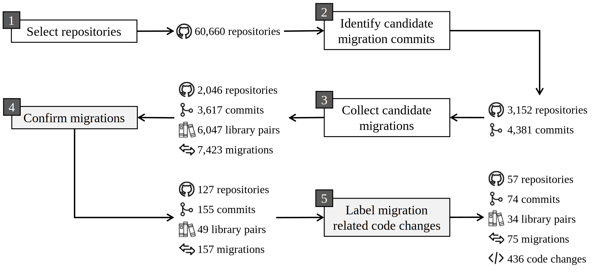

# Overview
Library migration is the process of replacing one library with another in a client project.
_PyMigBench_ is a benchmark of Python Library Migration that we have developed in the paper:
> Mohayeminul Islam, Ajay Kumar Jha, Sarah Nadi.
> PyMigBench and PyMigTax: A Benchmark and Taxonomy for Python Library Migration.
> _Empirical Software Engineering (Under Review)_.

Other than the benchmark, we have also developed _PyMigTax_,
a taxonomy of the migration related code changes that we have included in PyMigBench.
An overview of the construction process of PyMigBench is shown in the figure below.
The white boxes indicate automatic steps while grey boxes indicate manual steps.
The output of steps 4 and 5 constitute PyMigBench and we use output of step 5 to build PyMigTax.
Please read the [preprint version of the paper](https://arxiv.org/abs/2207.01124){:target="_blank"} to learn more about PyMigBench and PyMigTax.

The [PyMigBench repository]({{site.vars.repo}}) contains the benchmark data and the tool to explore the data.

## Dataset
The PyMigBench dataset is in the [data]({{ site.vars.repo }}/tree/main/data){:target="_blank"} folder. There are three main types of data: 
analogous library pairs, migrations and migration-related code changes.
Details about the dataset is in the [dataset](dataset) page.

## Tool
We provide a command line tool to easily access the dataset.
The source code of the tool is in the [code]({{ site.vars.repo }}/tree/main/code){:target="_blank"} folder.
The installation process and the syntax of the tool is in the [tool](tool) page.
The [examples](examples) page contains some use cases of the tool.

## Contributing
If you have some Python library migration data and would like to add them to PyMigBench, submit it to us and we will review and add it.
Please check the [contributor's guide]({{site.vars.repo}}//blob/main/CONTRIBUTING.md){:target="_blank"} for help.
